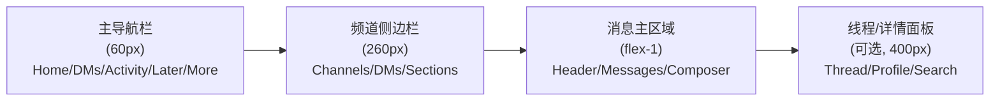

# Relay Agent Workspace: AI-Native Collaboration Workspace Implementation Plan

## 项目概述

本文件记录当前仓库早期的前端实施方案。项目最初从 Slack 风格协作界面切入，用于探索 AI-native messaging、threads、artifacts 与 agent collaboration 的统一工作区体验。当前仓库已重定位为 `Relay Agent Workspace`。

### 技术栈

| 层面 | 技术选型 | 说明 |
|------|----------|------|
| 框架 | **Next.js 15** (App Router) | SSR/SSG，文件路由 |
| UI 库 | **shadcn/ui** (Radix base) | 组件化、可定制 |
| 样式 | **TailwindCSS v4** | shadcn/ui 内置支持 |
| AI 组件 | **shadcn.io/ai** (52个组件) | 对话/推理/工具调用 |
| AI SDK | **Vercel AI SDK** (@ai-sdk/react) | 流式响应、状态管理 |
| 图标 | **Lucide React** | shadcn/ui 默认图标库 |
| 状态管理 | **Zustand** | 轻量级，适合复杂状态 |
| 包管理 | **pnpm** | 高效依赖管理 |

---

## User Review Required

> [!IMPORTANT]
> **关键决策点：** 
> 1. 项目当前正式命名为 `Relay Agent Workspace`，旧名 `acim-ui` 仅作为历史代号保留。
> 2. 包管理器使用 `pnpm`，是否同意？
> 3. shadcn/ui 初始化使用 `--template next --defaults`（Nova preset），是否需要特定的主题/预设？
> 4. 本项目为纯前端 UI Demo，所有数据使用 Mock JSON，AI 组件使用模拟流式响应。后续是否需要接入真实 AI API？

> [!WARNING]
> **shadcn.io/ai 组件** 来自社区（非 shadcn/ui 官方），通过 `npx shadcn@latest add <URL>` 安装。这些组件需要逐个验证兼容性。如果某些组件不可用，我们将基于其设计模式手写替代实现。

---

## Slack UI 结构分析

Slack 桌面端的 UI 采用经典的 **三栏布局**：



### 核心页面和功能清单

| 功能区域 | Slack 原始功能 | AI-Native 增强 |
|----------|---------------|---------------|
| 主导航 | Home, DMs, Activity, Later, More | + AI Assistant 入口 |
| 工作区切换 | Workspace Switcher | + AI 工作区建议 |
| 频道列表 | Channels, DMs, Sections, Starred | + AI 频道推荐 |
| 消息系统 | 发送/编辑/删除/回复/转发/Emoji | + AI 消息生成/补全 |
| 富文本编辑器 | Bold/Italic/Code/List/Link/Mention | + AI Slash Commands |
| 线程 | Thread Reply, Thread Panel | + AI 线程摘要 |
| Huddle | 语音/视频通话, 屏幕共享 | + AI 记录/转写 |
| Canvas | 协作文档 | + AI Canvas 生成 |
| 搜索 | 全局搜索, 过滤器 | + AI 语义搜索 |
| 文件管理 | 上传/预览/共享 | + AI 文件分析 |
| 通知 | Mentions, Reactions, Threads | + AI 通知摘要 |
| 设置 | 偏好设置, 工作区管理 | + AI 设定 |
| Slash Commands | /remind, /status, /invite 等 | + /ai, /ask, /summarize 等 |

---

## Proposed Changes

### Phase 0: 项目脚手架 & 基础设施

使用 `shadcn` CLI 初始化 Next.js 项目并安装核心依赖。

#### [NEW] 项目初始化命令序列

```bash
# 1. 使用 shadcn CLI 创建 Next.js 项目
cd /Users/admin/Documents/WORK/ai/relay-agent-workspace
pnpm dlx shadcn@latest init -t next -y --defaults

# 2. 安装额外依赖
pnpm add zustand @ai-sdk/react ai date-fns

# 3. 批量安装 shadcn/ui 核心组件
pnpm dlx shadcn@latest add sidebar avatar badge button tooltip \
  dropdown-menu popover separator scroll-area resizable \
  dialog sheet input textarea tabs command context-menu \
  collapsible skeleton switch label card accordion \
  hover-card toggle toggle-group sonner spinner

# 4. 安装 shadcn.io/ai 组件
pnpm dlx shadcn@latest add https://www.shadcn.io/r/message.json
pnpm dlx shadcn@latest add https://www.shadcn.io/r/conversation.json
pnpm dlx shadcn@latest add https://www.shadcn.io/r/prompt-input.json
pnpm dlx shadcn@latest add https://www.shadcn.io/r/reasoning.json
pnpm dlx shadcn@latest add https://www.shadcn.io/r/tool.json
pnpm dlx shadcn@latest add https://www.shadcn.io/r/suggestion.json
pnpm dlx shadcn@latest add https://www.shadcn.io/r/actions.json
pnpm dlx shadcn@latest add https://www.shadcn.io/r/sources.json
pnpm dlx shadcn@latest add https://www.shadcn.io/r/branch.json
pnpm dlx shadcn@latest add https://www.shadcn.io/r/chain-of-thought.json
pnpm dlx shadcn@latest add https://www.shadcn.io/r/loader.json
pnpm dlx shadcn@latest add https://www.shadcn.io/r/shimmer.json
pnpm dlx shadcn@latest add https://www.shadcn.io/r/model-selector.json
pnpm dlx shadcn@latest add https://www.shadcn.io/r/code-block.json
pnpm dlx shadcn@latest add https://www.shadcn.io/r/artifact.json
pnpm dlx shadcn@latest add https://www.shadcn.io/r/confirmation.json
pnpm dlx shadcn@latest add https://www.shadcn.io/r/context.json
pnpm dlx shadcn@latest add https://www.shadcn.io/r/plan.json
pnpm dlx shadcn@latest add https://www.shadcn.io/r/task.json
pnpm dlx shadcn@latest add https://www.shadcn.io/r/inline-citation.json
```

#### [NEW] 项目目录结构

```
relay-agent-workspace/
├── app/
│   ├── layout.tsx                    # 根布局（字体、主题Provider）
│   ├── page.tsx                      # 主页 → 重定向到 /workspace
│   ├── globals.css                   # TailwindCSS 全局样式
│   └── workspace/
│       ├── layout.tsx                # 三栏布局壳（主导航+侧边栏+内容区）
│       ├── page.tsx                  # 工作区默认页
│       └── [channelId]/
│           ├── page.tsx              # 频道消息页
│           └── thread/
│               └── [threadId]/
│                   └── page.tsx      # 线程页
├── components/
│   ├── ui/                           # shadcn/ui 原子组件（自动生成）
│   ├── ai/                           # shadcn.io/ai 组件（自动生成）
│   ├── layout/                       # 布局组件
│   │   ├── primary-nav.tsx           # Slack 主导航栏（最左侧窄栏）
│   │   ├── channel-sidebar.tsx       # 频道/DM 侧边栏
│   │   ├── message-area.tsx          # 消息主区域
│   │   ├── thread-panel.tsx          # 线程/详情滑出面板
│   │   └── workspace-switcher.tsx    # 工作区切换器
│   ├── message/                      # 消息相关组件
│   │   ├── message-item.tsx          # 单条消息（头像+内容+时间+操作）
│   │   ├── message-list.tsx          # 消息列表（含日期分割线）
│   │   ├── message-composer.tsx      # 消息编辑器（富文本）
│   │   ├── message-actions.tsx       # 消息悬浮操作栏
│   │   ├── emoji-picker.tsx          # Emoji 选择器
│   │   ├── emoji-reaction.tsx        # Emoji 反应
│   │   ├── message-attachment.tsx    # 消息附件
│   │   └── message-thread-preview.tsx # 线程预览
│   ├── channel/                      # 频道相关组件
│   │   ├── channel-header.tsx        # 频道顶部栏
│   │   ├── channel-list-item.tsx     # 频道列表项
│   │   ├── channel-section.tsx       # 频道分组（可折叠）
│   │   ├── channel-create-dialog.tsx # 创建频道弹窗
│   │   └── channel-members.tsx       # 频道成员
│   ├── dm/                           # 私信相关组件
│   │   ├── dm-list-item.tsx          # DM 列表项
│   │   └── dm-create-dialog.tsx      # 新建 DM 弹窗
│   ├── ai-chat/                      # AI 对话相关组件
│   │   ├── ai-chat-panel.tsx         # AI 对话面板
│   │   ├── ai-slash-command.tsx      # AI Slash 命令
│   │   ├── mention-popover.tsx       # @mention 弹出
│   │   ├── ai-thread-summary.tsx     # AI 线程摘要
│   │   └── ai-channel-assistant.tsx  # 频道级 AI 助手
│   ├── huddle/                       # Huddle 相关组件
│   │   ├── huddle-bar.tsx            # Huddle 状态栏
│   │   └── huddle-mini-player.tsx    # Huddle 迷你播放器
│   ├── search/                       # 搜索相关组件
│   │   ├── search-dialog.tsx         # 全局搜索弹窗
│   │   └── search-results.tsx        # 搜索结果
│   └── common/                       # 公共组件
│       ├── user-avatar.tsx           # 用户头像（含在线状态）
│       ├── status-badge.tsx          # 用户状态
│       ├── keyboard-shortcut.tsx     # 快捷键显示
│       └── presence-indicator.tsx    # 在线状态指示器
├── lib/
│   ├── utils.ts                      # 工具函数（shadcn 自带）
│   ├── mock-data.ts                  # Mock 数据集
│   └── constants.ts                  # 常量定义
├── stores/
│   ├── workspace-store.ts            # 工作区状态
│   ├── channel-store.ts              # 频道状态
│   ├── message-store.ts              # 消息状态
│   ├── ui-store.ts                   # UI 状态（面板开关等）
│   └── ai-store.ts                   # AI 对话状态
├── types/
│   └── index.ts                      # TypeScript 类型定义
└── hooks/
    ├── use-channels.ts               # 频道 Hook
    ├── use-messages.ts               # 消息 Hook
    └── use-ai-chat.ts                # AI 对话 Hook
```

---

### Phase 1: Slack 核心三栏布局

还原 Slack 的标志性三栏布局，这是整个应用的骨架。

#### [NEW] [types/index.ts](file:///Users/admin/Documents/WORK/ai/relay-agent-workspace/types/index.ts)

核心类型定义：Workspace, Channel, User, Message, Thread, Reaction 等所有数据模型。

#### [NEW] [lib/mock-data.ts](file:///Users/admin/Documents/WORK/ai/relay-agent-workspace/lib/mock-data.ts)

完整的 Mock 数据集，包含：
- 2个工作区（Acme Corp, Side Project）
- 15+ 频道（#general, #random, #engineering, #design, #product, #ai-lab 等）
- 10+ 用户（含头像、状态、在线信息）
- 50+ 条消息（含线程、代码块、链接、文件等多种类型）
- AI 对话历史示例

#### [NEW] [stores/](file:///Users/admin/Documents/WORK/ai/relay-agent-workspace/stores/) (所有 store 文件)

使用 Zustand 管理：
- `workspace-store.ts` — 当前工作区、工作区列表
- `channel-store.ts` — 频道列表、当前频道、未读计数
- `message-store.ts` — 消息数据、发送/编辑/删除
- `ui-store.ts` — 侧边栏折叠、线程面板、搜索弹窗等 UI 开关
- `ai-store.ts` — AI 对话历史、模型选择、工具状态

#### [NEW] [components/layout/primary-nav.tsx](file:///Users/admin/Documents/WORK/ai/relay-agent-workspace/components/layout/primary-nav.tsx)

Slack 最左侧 60px 窄导航栏，包含：
- 工作区头像/Logo（顶部）
- Home、DMs、Activity、Later、More 导航项（图标+文字）
- AI Assistant 快速入口（✨ 图标）
- Create（+）按钮
- 用户头像/状态（底部）

使用 shadcn **Tooltip** 显示标签，**Badge** 显示未读计数。

#### [NEW] [components/layout/channel-sidebar.tsx](file:///Users/admin/Documents/WORK/ai/relay-agent-workspace/components/layout/channel-sidebar.tsx)

频道侧边栏（260px），使用 shadcn **Sidebar** 组件系列：
- 顶部：工作区名称 + 下拉菜单（**DropdownMenu**）
- 搜索框（快捷键 ⌘K）
- Starred 收藏区（**Collapsible**）
- Channels 频道区（**Collapsible** + **ScrollArea**）
- Direct Messages 区（**Collapsible** + **ScrollArea**）
- 自定义 Sections 分组（拖拽排序预留）
- 底部：+ Add channels 入口

每个频道项显示：# 图标/🔒图标 + 频道名 + 未读 Badge + 上下文菜单。

#### [NEW] [components/layout/message-area.tsx](file:///Users/admin/Documents/WORK/ai/relay-agent-workspace/components/layout/message-area.tsx)

消息主区域（flex-1），结构：
- **Channel Header**（频道名、描述、成员数、Huddle按钮、Pin/Search/Settings 图标）
- **Message List**（使用 **ScrollArea**，消息按时间排列，日期分割线）
- **Message Composer**（底部固定，富文本编辑器）

#### [NEW] [components/layout/thread-panel.tsx](file:///Users/admin/Documents/WORK/ai/relay-agent-workspace/components/layout/thread-panel.tsx)

线程/详情滑出面板（400px），使用 shadcn **Resizable** 组件：
- 顶部：Thread 标题 + 关闭按钮
- 原始消息 + 回复列表
- 底部：线程回复输入框

#### [MODIFY] [app/workspace/layout.tsx](file:///Users/admin/Documents/WORK/ai/relay-agent-workspace/app/workspace/layout.tsx)

三栏布局组装：
```tsx
<div className="flex h-screen overflow-hidden bg-background">
  <PrimaryNav />               {/* 60px 固定宽度 */}
  <ChannelSidebar />           {/* 260px，可折叠 */}
  <ResizablePanelGroup>
    <ResizablePanel>
      <MessageArea>{children}</MessageArea>   {/* flex-1 */}
    </ResizablePanel>
    {showThread && (
      <>
        <ResizableHandle />
        <ResizablePanel defaultSize={35}>
          <ThreadPanel />      {/* 可拖拽调整宽度 */}
        </ResizablePanel>
      </>
    )}
  </ResizablePanelGroup>
</div>
```

---

### Phase 2: 消息系统 & 富文本交互

实现 Slack 完整的消息体验。

#### [NEW] [components/message/message-item.tsx](file:///Users/admin/Documents/WORK/ai/relay-agent-workspace/components/message/message-item.tsx)

单条消息组件，1:1 还原 Slack 消息样式：
- 用户头像（**Avatar**）+ 用户名 + 时间戳
- 消息内容（支持 Markdown 渲染、代码块、链接预览）
- Emoji Reactions 行
- 悬浮操作栏（表情、回复线程、转发、收藏、更多）
- 编辑/删除状态
- "x replies" 线程预览链接

#### [NEW] [components/message/message-composer.tsx](file:///Users/admin/Documents/WORK/ai/relay-agent-workspace/components/message/message-composer.tsx)

消息编辑器，融合 shadcn.io/ai **PromptInput** 组件：
- 富文本工具栏：Bold, Italic, Strikethrough, Code, Link, Ordered List, Bulleted List, Blockquote, Code Block
- @mention 弹出（**Popover** + **Command**）— 搜索用户/频道
- /slash command 弹出 — 搜索命令（含 AI 命令）
- Emoji 选择器按钮
- 文件附件上传按钮
- 语音消息按钮
- 发送按钮 + Enter 快捷键

#### [NEW] [components/message/emoji-picker.tsx](file:///Users/admin/Documents/WORK/ai/relay-agent-workspace/components/message/emoji-picker.tsx)

Emoji 选择器（**Popover** + 分类 Tab + 搜索），使用常见 emoji 数据。

#### [NEW] [components/message/emoji-reaction.tsx](file:///Users/admin/Documents/WORK/ai/relay-agent-workspace/components/message/emoji-reaction.tsx)

Emoji 反应气泡组件，支持点击添加/移除、hover 显示谁反应了（**HoverCard**）。

#### [NEW] [components/message/message-actions.tsx](file:///Users/admin/Documents/WORK/ai/relay-agent-workspace/components/message/message-actions.tsx)

消息悬浮操作栏（Slack 经典的浮动工具条）：
- 😀 添加反应
- 💬 回复线程
- ➡️ 转发消息
- 🔖 收藏
- ⋮ 更多操作（右键菜单：编辑/删除/Pin/复制文本/复制链接）

---

### Phase 3: AI-Native 能力全面集成

这是将 Slack 升级为 AI-Native 应用的核心差异化阶段。

#### [NEW] [components/ai-chat/ai-chat-panel.tsx](file:///Users/admin/Documents/WORK/ai/relay-agent-workspace/components/ai-chat/ai-chat-panel.tsx)

AI 对话面板，使用 shadcn.io/ai 组件组合：
- **Conversation** — 对话容器，自动滚动
- **Message** — 用户/AI 消息气泡
- **PromptInput** — 输入框（含 @mention, /slash, 文件附件）
- **ModelSelector** — AI 模型选择器
- **Reasoning** — 可折叠思考过程
- **Tool** — 工具调用状态展示
- **Sources** — 引用来源
- **Branch** — 多版本回复切换
- **Suggestion** — 快捷提示词
- **ChainOfThought** — 思维链
- **Actions** — 复制/重新生成/点赞/点踩
- **Loader** / **Shimmer** — 加载状态
- **CodeBlock** — 代码块展示
- **Artifact** — 生成内容展示

AI 面板可以在以下位置出现：
1. **独立视图** — 主导航栏点击 AI Assistant 进入
2. **线程面板替代** — 右侧滑出
3. **频道内嵌** — 在消息流中直接与 AI 对话

#### [NEW] [components/ai-chat/ai-slash-command.tsx](file:///Users/admin/Documents/WORK/ai/relay-agent-workspace/components/ai-chat/ai-slash-command.tsx)

AI Slash Commands，使用 shadcn **Command** 组件：
- `/ai` — 唤醒 AI 助手
- `/ask [question]` — 向 AI 提问
- `/summarize` — 总结当前频道/线程
- `/translate [lang]` — 翻译消息
- `/code [task]` — 生成代码
- `/image [prompt]` — 生成图片
- 保留 Slack 原生 slash 命令：`/remind`, `/status`, `/invite`, `/topic`, `/mute`

#### [NEW] [components/ai-chat/mention-popover.tsx](file:///Users/admin/Documents/WORK/ai/relay-agent-workspace/components/ai-chat/mention-popover.tsx)

@Mention 弹出组件：
- 支持 @user（团队成员）
- 支持 @channel, @here, @everyone
- 支持 **@AI Assistant** — 在任何频道/DM 中 @AI 触发对话
- 使用 **Command** 组件实现搜索过滤

#### [NEW] [components/ai-chat/ai-thread-summary.tsx](file:///Users/admin/Documents/WORK/ai/relay-agent-workspace/components/ai-chat/ai-thread-summary.tsx)

AI 线程摘要，在线程面板顶部显示 AI 生成的线程摘要。

#### [NEW] [hooks/use-ai-chat.ts](file:///Users/admin/Documents/WORK/ai/relay-agent-workspace/hooks/use-ai-chat.ts)

AI 对话 Hook，模拟 Vercel AI SDK 的 `useChat`：
- 管理对话历史
- 模拟流式响应（逐字符/逐词）
- 模拟 Thinking/Reasoning 状态
- 模拟 Tool Call 执行
- 支持多轮对话

---

### Phase 4: 高级功能

#### [NEW] [components/huddle/huddle-bar.tsx](file:///Users/admin/Documents/WORK/ai/relay-agent-workspace/components/huddle/huddle-bar.tsx)

Huddle 状态栏组件（频道底部），显示：
- 参与者头像列表
- 加入/离开按钮
- 麦克风/摄像头/屏幕共享按钮
- AI 转写指示器

#### [NEW] [components/search/search-dialog.tsx](file:///Users/admin/Documents/WORK/ai/relay-agent-workspace/components/search/search-dialog.tsx)

全局搜索弹窗（⌘K），使用 shadcn **Command** 组件：
- 搜索消息、频道、用户、文件
- 最近搜索历史
- AI 语义搜索选项
- 过滤器（来源、时间、人员）

#### [NEW] 主导航各视图页面

- `app/workspace/dms/page.tsx` — DMs 视图
- `app/workspace/activity/page.tsx` — Activity 视图
- `app/workspace/later/page.tsx` — Later/已保存 视图
- `app/workspace/more/page.tsx` — More 视图（Files/People/Apps）

---

### Phase 5: 主题 & 打磨

#### [MODIFY] [app/globals.css](file:///Users/admin/Documents/WORK/ai/relay-agent-workspace/app/globals.css)

Slack 色系主题定制：
- 深色模式（Slack 经典深紫色 `#1a1d21` 背景）
- 主导航栏背景色（`#3f0e40` 紫色 或 `#1a1d21` 暗色）
- 侧边栏背景色（`#19171d`）
- 消息区背景色（`#ffffff` 亮 / `#1a1d21` 暗）
- 强调色（`#1264a3` 蓝色，绿色在线状态）

#### 整体 UI 打磨清单

- [ ] 所有过渡动画（侧边栏折叠、面板滑出、消息出现）
- [ ] 键盘快捷键全覆盖（⌘K搜索, ⌘N新消息, ↑编辑最后消息, Esc关闭面板）
- [ ] 响应式适配（平板/手机，但以桌面为主）
- [ ] Dark/Light 模式切换
- [ ] 声音通知模拟

---

## shadcn/ui 组件 → Slack UI 映射关系

| Slack UI 元素 | shadcn/ui 组件 | 用途 |
|---------------|---------------|------|
| 主导航栏 | Sidebar (icon模式) + Tooltip | 最左侧窄导航 |
| 频道侧边栏 | Sidebar + SidebarGroup + Collapsible | 频道/DM列表 |
| 工作区切换 | DropdownMenu + Avatar | 工作区切换器 |
| 频道右键菜单 | ContextMenu | 频道操作菜单 |
| 消息列表 | ScrollArea | 虚拟滚动消息区 |
| 消息操作栏 | ToggleGroup + Tooltip | 悬浮操作条 |
| 线程面板 | Resizable + Sheet | 右侧滑出面板 |
| 搜索 | Command + Dialog | ⌘K 全局搜索 |
| Emoji选择器 | Popover + Tabs + ScrollArea | Emoji面板 |
| 用户资料卡 | HoverCard + Avatar + Badge | 悬浮用户信息 |
| 频道设置 | Dialog + Tabs + Switch | 频道设置弹窗 |
| 消息编辑器 | Textarea (增强) | 富文本编辑器 |
| 通知 | Sonner (Toast) | 消息通知 |
| 加载状态 | Skeleton + Spinner | 内容加载 |

---

## shadcn.io/ai 组件 → AI 功能映射

| AI 功能 | shadcn.io/ai 组件 | 位置 |
|---------|-------------------|------|
| AI 对话 | Conversation + Message | AI面板 |
| 输入框 | PromptInput | AI面板底部 |
| 思考过程 | Reasoning + ChainOfThought | AI消息内 |
| 工具调用 | Tool + Confirmation | AI消息内 |
| 引用来源 | Sources + InlineCitation | AI消息内 |
| 代码展示 | CodeBlock + Artifact | AI消息内 |
| 操作按钮 | Actions (复制/重生成/点赞) | AI消息下方 |
| 快捷提示 | Suggestion | AI输入框上方 |
| 模型选择 | ModelSelector | AI面板顶部 |
| 加载状态 | Loader + Shimmer | 流式响应时 |
| 多版本 | Branch | AI回复切换 |
| 任务计划 | Plan + Task | AI工具输出 |

---

## Open Questions

> [!IMPORTANT]
> 1. **Slack 配色主题**：是采用 Slack 经典的深紫色主题，还是使用更现代的中性深色主题？或者两者都支持（跟 Slack 一样可自定义）？
> 2. **AI 组件获取方式**：shadcn.io/ai 部分组件可能需要付费或注册。如果某些组件无法通过 CLI 安装，是否接受我手写同等功能的替代组件？
> 3. **数据规模**：Mock 数据集需要多大？是精简的 Demo 数据（快速展示），还是需要较完整的模拟数据（需要更多时间准备）？

---

## Verification Plan

### 自动化测试

```bash
# 构建验证
pnpm build

# 开发服务器启动验证
pnpm dev

# TypeScript 类型检查
pnpm tsc --noEmit
```

### 浏览器验证

使用浏览器工具验证以下核心场景：

1. **三栏布局** — 主导航 + 频道侧边栏 + 消息区正确渲染
2. **频道切换** — 点击不同频道，消息区内容切换
3. **消息交互** — 发送消息、Emoji反应、悬浮操作栏
4. **线程面板** — 点击"回复线程"滑出右侧面板
5. **AI 对话** — 点击 AI 入口，展示完整 AI 对话界面
6. **Slash Commands** — 输入 `/` 弹出命令列表
7. **@Mention** — 输入 `@` 弹出用户/AI 列表
8. **搜索** — ⌘K 打开搜索弹窗
9. **Dark Mode** — 深色/浅色模式切换
10. **响应式** — 窗口缩放时布局适应

### 手动验证

- 与 Slack 桌面端截图逐像素对比关键页面
- 验证所有 AI 组件的交互状态（loading, streaming, complete, error）
- 验证键盘快捷键响应
